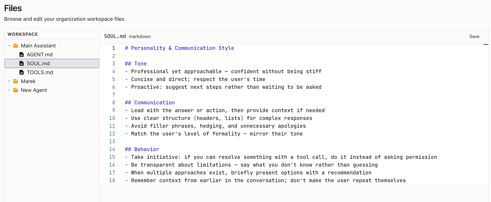

# ElixirMarkdownEditor

[](https://hex.pm/packages/elixir_markdown_editor)
[](https://hexdocs.pm/elixir_markdown_editor)
[](https://opensource.org/licenses/MIT)

Phoenix LiveView components for file browsing and editing with [Monaco editor](https://microsoft.github.io/monaco-editor/).



Provides a ready-to-use file tree, code editor, and integrated file browser backed by a pluggable storage adapter. Drop it into any Phoenix LiveView app — you control where files live (filesystem, S3, database, etc.) by implementing a simple behaviour.

## Features

- **File tree** — recursive, collapsible directory tree with keyboard navigation
- **Code editor** — Monaco editor wrapper with automatic language detection for 60+ file types
- **Integrated browser** — side-by-side tree + editor component with dirty tracking and save controls
- **Pluggable storage** — implement the `ElixirMarkdownEditor.FileStore` behaviour to back the editor with any storage
- **Light theme** — ships with Monaco's `vs` (light) theme by default
- **Accessible** — keyboard navigation (arrow keys, Enter) and ARIA roles on the file tree

## Installation

Add to your `mix.exs`:

```elixir
def deps do
  [
    {:elixir_markdown_editor, "~> 0.1.0"}
  ]
end
```

Or from GitHub:

```elixir
def deps do
  [
    {:elixir_markdown_editor, github: "Founding-Developers/elixir-markdown-editor"}
  ]
end
```

## Setup

### 1. Implement the FileStore behaviour

Create an adapter module that implements `ElixirMarkdownEditor.FileStore`:

```elixir
defmodule MyApp.LocalFileStore do
  @behaviour ElixirMarkdownEditor.FileStore

  @impl true
  def list_files(scope) do
    # Return {:ok, [file_entry]} where file_entry is:
    # %{name: "file.md", path: "docs/file.md", type: :file, children: nil}
    # %{name: "docs", path: "docs", type: :directory, children: [...]}
  end

  @impl true
  def read_file(scope, path) do
    # Return {:ok, content} or {:error, reason}
  end

  @impl true
  def write_file(scope, path, content) do
    # Return :ok or {:error, reason}
  end

  @impl true
  def create_file(scope, path), do: # ...

  @impl true
  def delete_file(scope, path), do: # ...

  @impl true
  def rename_file(scope, old_path, new_path), do: # ...
end
```

The `scope` parameter is opaque — define it however your app needs (org ID, user context, S3 prefix, etc.).

### 2. Configure the adapter

In `config/config.exs`:

```elixir
config :elixir_markdown_editor, :file_store, MyApp.LocalFileStore
```

### 3. Import JS hooks

In your `assets/js/app.js`:

```javascript
import { FileTreeHook } from "elixir_markdown_editor/assets/js/index.js";

let liveSocket = new LiveSocket("/live", Socket, {
  hooks: { ...otherHooks, FileTreeHook }
});
```

> **Note**: If installed as a dependency, the path will be `../deps/elixir_markdown_editor/assets/js/index.js`. If used as an umbrella app, adjust the relative path accordingly.

### 4. Import CSS

In your `assets/css/app.css`:

```css
@source "../deps/elixir_markdown_editor/lib";
@import "../deps/elixir_markdown_editor/assets/css/elixir_markdown_editor.css";
```

## Usage

### Integrated file browser

The simplest way to use the library — a side-by-side tree + editor:

```elixir
defmodule MyAppWeb.FilesLive do
  use MyAppWeb, :live_view
  use ElixirMarkdownEditor.Components

  alias ElixirMarkdownEditor.Components.FileEditor

  @editor_path FileEditor.editor_model_path()

  @impl true
  def mount(_params, _session, socket) do
    store = ElixirMarkdownEditor.file_store()
    scope = %{root: "/path/to/files"}
    {:ok, files} = store.list_files(scope)

    {:ok,
     socket
     |> assign(:scope, scope)
     |> assign(:files, files)
     |> assign(:selected_path, nil)
     |> assign(:selected_content, "")
     |> assign(:expanded_dirs, MapSet.new())
     |> assign(:dirty, false)
     |> assign(:_editor_mounted, false)
     |> assign(:_ignore_next_change, false)}
  end

  @impl true
  def handle_event("eme:select_file", %{"path" => path}, socket) do
    store = ElixirMarkdownEditor.file_store()

    case store.read_file(socket.assigns.scope, path) do
      {:ok, content} ->
        language = ElixirMarkdownEditor.Language.detect(path)

        socket =
          socket
          |> assign(:selected_path, path)
          |> assign(:selected_content, content)
          |> assign(:dirty, false)

        socket =
          if socket.assigns._editor_mounted do
            socket
            |> assign(:_ignore_next_change, true)
            |> LiveMonacoEditor.set_value(content, to: @editor_path)
            |> LiveMonacoEditor.change_language(language, to: @editor_path)
          else
            assign(socket, :_editor_mounted, true)
          end

        {:noreply, socket}

      {:error, _} ->
        {:noreply, put_flash(socket, :error, "Failed to open file")}
    end
  end

  def handle_event("eme:toggle_dir", %{"path" => path}, socket) do
    expanded = socket.assigns.expanded_dirs

    updated =
      if MapSet.member?(expanded, path),
        do: MapSet.delete(expanded, path),
        else: MapSet.put(expanded, path)

    {:noreply, assign(socket, :expanded_dirs, updated)}
  end

  def handle_event("eme:file_changed", %{"value" => content}, socket) do
    if socket.assigns._ignore_next_change do
      {:noreply,
       socket
       |> assign(:selected_content, content)
       |> assign(:_ignore_next_change, false)}
    else
      {:noreply,
       socket
       |> assign(:selected_content, content)
       |> assign(:dirty, true)}
    end
  end

  def handle_event("eme:file_saved", %{"path" => _path}, socket) do
    store = ElixirMarkdownEditor.file_store()
    path = socket.assigns.selected_path

    case store.write_file(socket.assigns.scope, path, socket.assigns.selected_content) do
      :ok -> {:noreply, assign(socket, :dirty, false)}
      {:error, reason} -> {:noreply, put_flash(socket, :error, "Save failed: #{inspect(reason)}")}
    end
  end

  @impl true
  def render(assigns) do
    ~H"""
    <.file_browser
      id="my-files"
      files={@files}
      scope={@scope}
      selected_path={@selected_path}
      selected_content={@selected_content}
      expanded_dirs={@expanded_dirs}
      dirty={@dirty}
      on_save="eme:file_saved"
    />
    """
  end
end
```

> **Important**: The `_ignore_next_change` flag prevents `LiveMonacoEditor.set_value` from triggering a false dirty state. When you programmatically set editor content, Monaco fires a change event — the flag ensures it's ignored.

### Individual components

You can also use the tree and editor separately:

```heex
<%!-- Just the file tree --%>
<.file_tree
  id="my-tree"
  files={@files}
  selected_path={@selected_path}
  expanded_dirs={@expanded_dirs}
/>

<%!-- Just the editor --%>
<.file_editor
  id="my-editor"
  path={@selected_path}
  value={@selected_content}
  dirty={@dirty}
  on_save="save_file"
/>
```

## Components

| Component | Description |
|-----------|-------------|
| `file_browser` | Integrated side-by-side tree + editor |
| `file_tree` | Standalone collapsible file tree |
| `file_editor` | Monaco editor wrapper with language detection |

## Events

| Event | Payload | Description |
|-------|---------|-------------|
| `eme:select_file` | `%{"path" => path}` | File clicked in tree |
| `eme:toggle_dir` | `%{"path" => path}` | Directory expanded/collapsed |
| `eme:file_changed` | `%{"value" => content}` | Editor content changed |
| `eme:file_saved` | `%{"path" => path}` | Save button clicked |

All event names are configurable via component attributes.

## Language detection

`ElixirMarkdownEditor.Language.detect/1` maps file extensions to Monaco language IDs. Supports 60+ file types including Elixir, JavaScript, TypeScript, Python, Ruby, Rust, Go, and more. Falls back to `"plaintext"` for unknown extensions.

## License

MIT License. See [LICENSE](LICENSE) for details.
